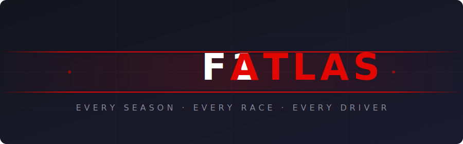

<p align="center">
  
</p>

<p align="center">
  <strong>Browse every Formula 1 season: race calendars, results, qualifying, standings, and driver profiles.</strong>
</p>

<p align="center">
  
  
  
  
</p>

---

## 🏁 About

**F1 Atlas** is a single-page application for exploring the world of Formula 1, past and present. Pick any season from the dropdown and browse the full race calendar, dive into individual race results and qualifying times, check the championship standings, or view detailed driver profiles with season stats.

Built with React 19, styled with Tailwind CSS v4, and powered by the [Jolpica F1 API](https://github.com/jolpica/jolpica-f1) (the successor to Ergast). No authentication, no API keys, no backend. Just clean client-side data fetching.

## ✨ Features

| Feature | Status |
|:---|:---:|
| Current season race calendar | ✅ |
| Race results & finishing order | 🔧 In progress |
| Qualifying times (Q1/Q2/Q3) | 🔧 In progress |
| Driver & constructor standings | 🔧 In progress |
| Driver profiles & season stats | 🔜 Planned |
| Season selector (browse any year) | 🔜 Planned |
| Responsive, mobile-first design | 🔜 Planned |
| Deployed on GitHub Pages | 🔜 Planned |

## 🛠 Tech Stack

- **React 19** for components, hooks, and context
- **React Router 7** for declarative client-side routing
- **Tailwind CSS 4** for utility-first styling with `@theme` configuration
- **Vite 6** as the dev server and build tool
- **Jolpica F1 API** for open Formula 1 data (no auth required)

## 🚀 Getting Started

```bash
git clone https://github.com/bytiagodev/f1-atlas.git
cd f1-atlas
npm install
npm run dev
```

Open `http://localhost:5173` to see the app.

## 📋 Roadmap

> Features on the horizon.

- **Head-to-head comparison**: select two drivers, compare their results side by side across a season
- **Favourites system**: bookmark drivers and races, persisted with localStorage
- **Circuit history page**: tap a circuit to see every winner in its history
- **Dark / light theme toggle**: switch between themes
- **Search**: find any driver by name across all seasons
- **Pit stop strategy**: visualise pit stop timing and strategy per race
- **Sprint race results**: display sprint results when available
- **Page transitions & animations**: smooth entrance animations and route transitions

## 📄 License

MIT

---

<p align="center">
  <sub>Data provided by the <a href="https://github.com/jolpica/jolpica-f1">Jolpica F1 API</a></sub>
</p>
