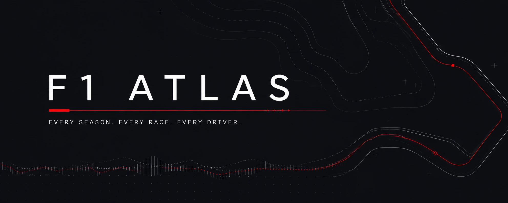

  

<h1 align="center">F1 Atlas</h1>
<h3 align="center">Every season. Every race. Every driver.</h3>

  
  
  

  <a href="https://bytiagodev.github.io/f1-atlas"><strong>[ View Live ]</strong></a>

---

## The Atlas

Formula 1 has been racing since 1950. That is over seven decades of grand prix weekends, world champions, legendary circuits, and teams that came and went. F1 Atlas puts all of it in one place.

This is not a live race tracker. It is not a fan wiki. It is an atlas. You open it, you pick a year, and you start exploring. The data does the talking.

---

## What You Will Find

You land on the current season. The full race calendar is laid out in front of you: every round, every circuit, every date. Completed races show the podium finishers right on the card, with driver photos and finishing times, so you can see who won without tapping in. Upcoming races carry circuit outline SVGs and country flags to give each card a sense of place. Sprint weekends are marked on the calendar so you know which rounds have the extra race.

Tap into a race and you get the complete picture. The finishing order, sprint results for weekends that have them, the qualifying breakdown with Q1, Q2, and Q3 times, grid positions, time gaps, points scored. FIA-standard status codes (DNF, DNS, DSQ, lapped positions) are all handled correctly. Everything that happened that weekend, in one place.

Switch to the standings and the championship unfolds. Drivers and constructors ranked by points, wins tallied, the title fight told in numbers. Tap any driver's name and you are looking at their full season: every race they entered, where they qualified, where they finished, how many points they scored. Driver photos are pulled from Wikipedia for the detail page, with no placeholder when one is unavailable.

Then there is the season selector. Change the year and the entire app updates. 2024. 2012. 1988. 1950. Same interface, different era. Over seven decades of racing, all navigable from a single dropdown.

---

## Design Direction

The visual language is deliberate. F1 Atlas is designed to feel like a race programme, not a TV broadcast overlay.

The palette is dark and restrained. A deep background (`#15151e`) with slightly lifted surface cards (`#12121a`), secondary text in muted grey (`#8b95a5`), and F1 red (`#e10600`) used only where it earns attention: the wordmark accent, active states, error messages. No team-colour gradients. No glassmorphism. No hero images of cars.

Typography is set in [Space Grotesk](https://fonts.google.com/specimen/Space+Grotesk), a geometric sans-serif with a technical character that fits the sport. Labels, headers, navigation, and metadata are all uppercase with wide letter-spacing. Content text (driver names, race names) stays in normal case for readability.

The race cards on the home page come in three states. Completed races carry a checkered-flag date pill and a podium bar showing the top three finishers with driver headshots pulled from the F1 Cloudinary CDN. The next race is highlighted with a distinct blue background. Upcoming races show the circuit outline and date. Circuit SVGs are sourced from [julesr0y/f1-circuits-svg](https://github.com/julesr0y/f1-circuits-svg) (CC-BY-4.0) and rendered inline with no additional network requests.

Country flags come from [flagcdn.com](https://flagcdn.com), covering both the current calendar and historical venues back to the 1950s.

Everything is responsive. Tables scroll horizontally on narrow screens. The driver detail layout stacks on mobile. Stats and navigation adapt at each breakpoint.

---

## Under the Hood

| What | How |
|------|-----|
| **The chassis** | React 19 + Vite 6 |
| **The livery** | Tailwind CSS v4 with a custom editorial palette |
| **The grid** | React Router 7, declarative mode |
| **The telemetry** | [Jolpica F1 API](https://github.com/jolpica/jolpica-f1), the community successor to Ergast |
| **The garage** | GitHub Pages |

No backend. No authentication. No API keys. Everything runs client-side.

---

## On the Radar

**Circuit history.** Tap a circuit and see every winner who has ever raced there. Decades of results at one track. This is the most "atlas" feature not yet built, and the one most aligned with what the app is about.

---

  All race data is provided by the <a href="https://github.com/jolpica/jolpica-f1">Jolpica F1 API</a>, the community-maintained successor to the Ergast API.

  F1 Atlas is an independent, non-commercial project built out of love for the sport and its history. It is not affiliated with or endorsed by Formula 1, the FIA, or any team, driver, or rights holder. Formula 1 and F1 are trademarks of Formula One Licensing BV.

